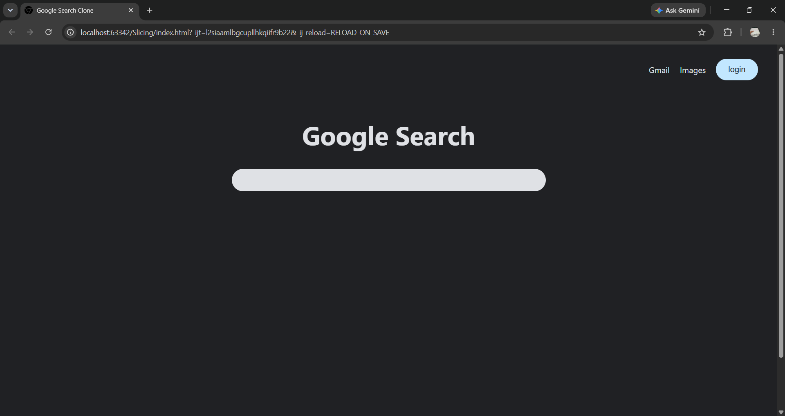
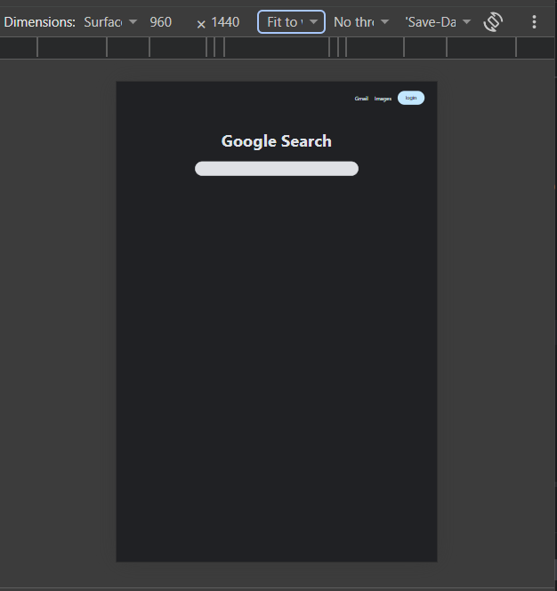
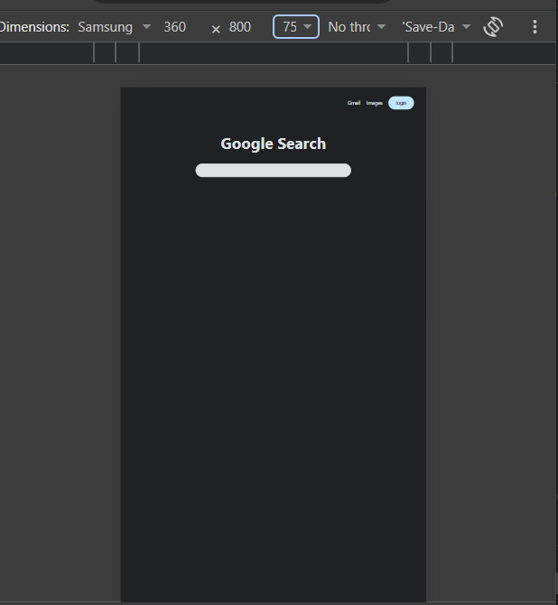

## Tugas Slicing dengan target **[Google Search](https://www.google.com/search)**
Project simpel yang target nya google search karena simpel banget dan enak buat belajar

## Demo
https://dprapandita.github.io/Tugas-Slicing-google-search/

### Desktop

### Tablet

### Mobile

## Fitur

- Layar responsive untuk mobile, tablet, desktop
- Simpel interaksi search input
- Pencet `Enter` untuk mencari

## Teknologi

- HTML5
- CSS3 (plain)
- JavaScript (Vanilla JS)

## Kekurangan
- Hanya di test di chrome browser
- Tidak seperti google search yang asli